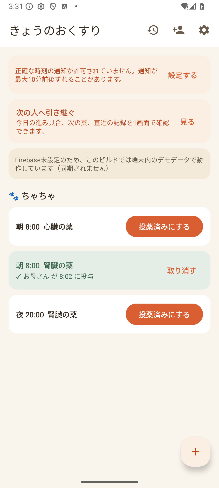
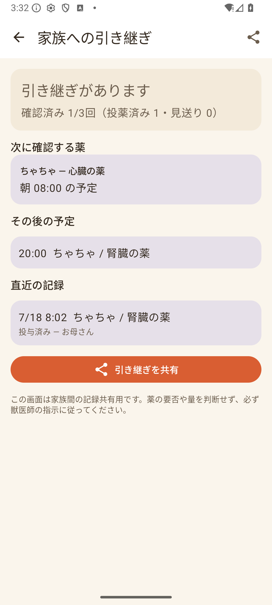

# Okusuri Toban — Shared Pet Medication Handoff

An Android app that helps families coordinate medication records for aging or
chronically ill pets. It makes one safety-critical question easy to answer:
**has someone already given this dose?**

Built during OpenAI Build Week 2026 with Codex and GPT-5.6.

[Watch/download the 95-second English demo](https://github.com/aomizuki0307/pet-med-handoff/releases/download/build-week-2026/build-week-demo.mp4).

> Okusuri Toban records and shares caregiver actions. It does not diagnose,
> recommend medication, interpret dosage, or replace veterinary instructions.

## The problem

When several family members care for the same pet, medication status is often
buried in chat messages or remembered by one person. A delayed reply can lead to
a missed dose or two people recording the same dose. Okusuri Toban gives the
household one append-only timeline with the caregiver and time attached.

## Product experience

- **Today's schedule:** see every due dose grouped by pet and record given or skipped.
- **Double-record warning:** before a second given record is written, show who
  already recorded the dose and when.
- **Care handoff:** summarize today's progress, the next unresolved dose,
  duplicate warnings, and recent caregiver activity on one screen.
- **Share sheet:** send a bounded handoff summary without dosage instructions.
- **Notification actions:** record from an Android reminder with idempotency protection.
- **Household sync:** the production flavor uses anonymous Firebase Auth and
  Firestore real-time listeners; the judgeable mock flavor needs no account.
- **Audit-friendly history:** corrections append a cancellation record instead
  of rewriting the original event.

| Today | Care handoff |
|---|---|
|  |  |

## Try the judgeable build

Download the account-free judge APK from the
[Build Week release](https://github.com/aomizuki0307/pet-med-handoff/releases/tag/build-week-2026),
or build it locally below.

### Supported platform

- Android 8.0 (API 26) or later
- Windows, macOS, or Linux for building with JDK 17 and the included Gradle wrapper

### Build and test

The `mock` flavor contains deterministic sample data and has no Firebase or API
key requirement. It is the fastest way to evaluate the complete product flow.

```powershell
cd android
.\gradlew.bat testMockDebugUnitTest assembleMockDebug
```

Install the generated APK:

```powershell
adb install -r app\build\outputs\apk\mock\debug\app-mock-debug.apk
```

The demo household opens automatically with an aging cat, two medications, and
one dose already recorded by another caregiver. Tap **見る** on the handoff card
to review the new Build Week feature. No real medical or personal data is used.

For production Firebase setup, see [`docs/10_setup_firebase.md`](docs/10_setup_firebase.md).

## Architecture

```text
Jetpack Compose UI
        |
    AppViewModel
        |
PetCareRepository interface
   |                  |
Mock in-memory     Firebase Auth + Firestore
judge/demo flavor  production flavor
        |
Pure Kotlin safety domain
(schedule expansion, effective append-only records,
 double-record detection, caregiver handoff summary)
```

The handoff builder is deterministic and reads the same effective record set as
the Today and History screens. Cancelled records are excluded, while two active
given records for the same schedule slot produce a visible warning. The builder
never reads or interprets free-text dosage instructions.

## How Codex and GPT-5.6 were used

The project was created during the Build Week submission period. Codex was used
as an implementation and review partner, with GPT-5.6 selected in the Codex
configuration.

Codex accelerated:

- tracing a flavor-specific Gradle failure caused by a production
  `google-services.json` being processed for the credential-free mock app;
- implementing the care-handoff domain model, Compose screen, navigation, share
  flow, deterministic demo state, and regression tests;
- checking the implementation against the official Build Week requirements and
  preparing the English submission and demo narrative.

The human-directed product and safety decisions were:

- keep the product focused on family coordination rather than medical advice;
- retain append-only records and explicit cancellation events;
- show duplicate records as a warning without inferring whether medicine was
  physically administered;
- exclude dosage text from the shared handoff message; and
- prioritize a runnable, account-free judge experience over adding more services.

The main Build Week Codex thread is recorded as session
`019f7203-4816-7e11-a87d-e21e93f74186`. See
[`docs/BUILD_WEEK_DEVELOPMENT.md`](docs/BUILD_WEEK_DEVELOPMENT.md) for the dated
new-work record.

The demo is reproducible with `video/build_demo.ps1`; its four narration source
files and captured evidence remain in the repository.

## Test coverage

Pure Kotlin unit tests cover:

- date and weekday schedule expansion;
- late-dose and duplicate-record rules;
- cancellation semantics;
- free/trial plan boundaries; and
- handoff progress, overdue ordering, duplicate warnings, and recent activity.

Current verification: **22 tests, 0 failures**, Android lint passing, and a
successful cold start plus share-flow check on an Android emulator.

The mock build also verifies that Firebase configuration present on a developer
machine cannot break the account-free judge APK.

## Repository layout

```text
android/   Kotlin + Jetpack Compose app (mock/prod flavors)
lp/        Japanese validation landing page and consent-based analytics beacon
docs/      Product, privacy, Firebase, Build Week, and testing documentation
```

## Privacy and safety

- No diagnosis, treatment, interaction checking, or dosage recommendation.
- No pet name, medicine name, dosage, or notes in analytics events.
- Anonymous authentication for the production prototype.
- Household data deletion and member-exit flows are included.
- The landing page and app privacy disclosures are in
  [`docs/06_security_privacy_policy.md`](docs/06_security_privacy_policy.md).

## Status

Build Week prototype and closed-test candidate. Payments are intentionally not
enabled; purchase buttons only record aggregate validation intent.

## License

MIT — see [`LICENSE`](LICENSE).
