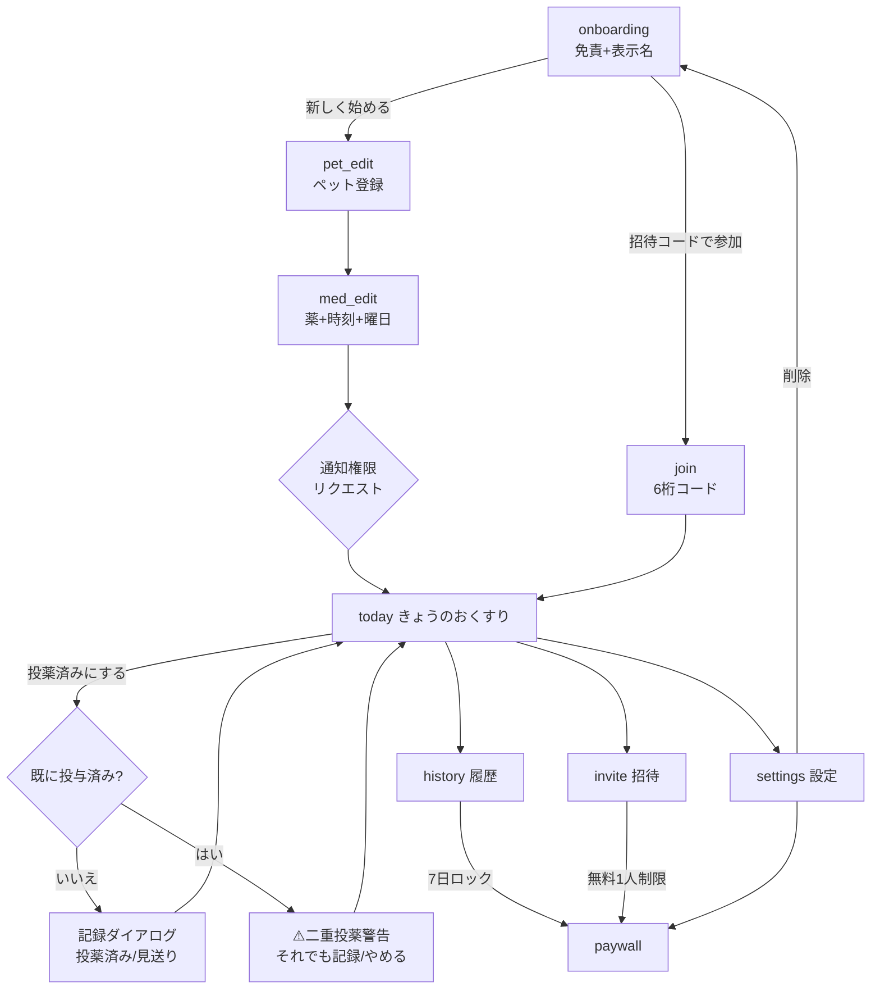
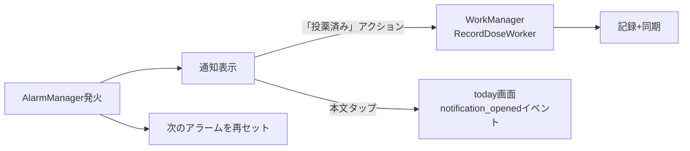

# 04. 画面一覧とユーザーフロー

## 画面一覧

| # | route | 画面 | 主目的 |
|---|---|---|---|
| 1 | `onboarding` | オンボーディング | 価値説明+免責、開始/参加の分岐 |
| 2 | `join` | 招待コードで参加 | 6桁コード+表示名 |
| 3 | `pet_edit` | ペット登録/編集 | 名前・犬猫・年齢 |
| 4 | `med_edit` | 薬登録/編集 | 薬名・用量自由文・時刻スロット・曜日 |
| 5 | `today` | **きょうのおくすり（メイン）** | 今日のスロット一覧、1タップ記録、権限カード |
| 6 | (dialog) | 記録ダイアログ/二重警告 | 投薬済み/見送り、二重投薬の警告 |
| 7 | `history` | 投薬履歴（監査ログ） | 誰が・いつ・何を。無料は7日でロック |
| 8 | `invite` | 家族を招待 | コード発行・共有Intent・メンバー一覧 |
| 9 | `paywall` | プラン | 価格表示+purchase_intent計測（課金なし） |
| 10 | `settings` | 設定 | 表示名・権限・プライバシー・削除 |

## メインフロー

## 通知フロー

## 家族共有フロー（検証仮説H3の主経路）

1. 世帯Aのオーナーが invite でコード発行 → LINE等で共有（共有Intent）
2. 家族Bがアプリをインストール → onboarding →「招待コードで参加」
3. B の記録が A の today にリアルタイム反映（`invite_accepted` → `dose_recorded(isSecondCaregiver=true)`）
